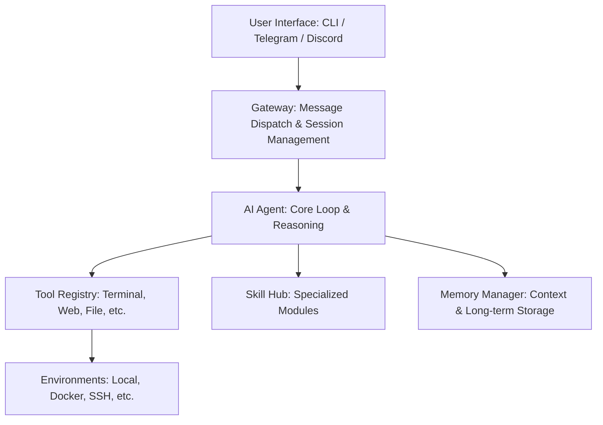

# goldfish 🐠

`Goldfish` is an advanced, evolving AI agent designed to learn from every interaction. Unlike traditional static agents, it builds a persistent understanding of your preferences, picks up new skills on the fly, and expands its capabilities through a modular ecosystem of tools and skills. `Goldfish` makes coding task handy💻, debugging easy👾, reviewing large codebase📚 like eating a small piece of pizza 🍕


## ✨ Key Features

- **🧠 Adaptive Learning**: Remembers context, user preferences, and past conversations to build a personalized experience.
- **🛠️ Modular Toolsets**: A robust library of tools ranging from terminal orchestration and file manipulation to web browsing and code execution.
- **🌟 Skill Ecosystem**: Easily discover, install, and use "Skills"—specialized capabilities (e.g., blockchain, creative, devops) that extend the agent's power.
- **🔌 Multi-Platform Gateway**: Interact with your agent via your favorite interfaces:
  - **CLI**: A high-performance, customizable terminal interface with "skins" and "kawaii" animations.
  *   **Messaging Platforms**: Connect via Telegram, Discord, Slack, WhatsApp, and more.
- **⚙️ Agentic Workflow**: Supports subagent delegation, complex task planning, and background process management.
- **🛡️ Secure & Sandboxed**: Execute code and tools within controlled environments (Local, Docker, SSH, Modal, etc.).

---

## 🏗️ Architecture Overview

The `goldfish` architecture is built on a decoupled, modular design:



---

### Core Components

1.  **The Agent (`AI Agent`)**: The central intelligence. It manages the conversation loop, processes tool calls, and maintains the internal state.
2.  **The Tool Registry**: A unified interface for all capabilities. Every tool (e.g., `terminal_tool.py`) registers itself, allowing the agent to discover and invoke them dynamically.
3.  **The Gateway**: The bridge between the agent and the outside world. It adapts the agent's capabilities to various messaging protocols (Webhooks, Bot APIs).
4.   **Skills & Plugins**: High-level abstractions built on top of tools. Skills allow the agent to perform complex, domain-specific tasks (e.g., `research-paper-writing`).

---

## 📂 Project Structure (golden agent)

```text
.
├── goldfish/            # The core engine (please refer to the core repo)
│   ├── agent/           # Agent internals (Prompting, Context, Memory)
│   ├── gold_cli/        # CLI subcommands, themes (skins), and setup
│   ├── tools/           # Implementation of all interactive tools
│   ├── gateway/         # Platform adapters (Telegram, Discord, etc.)
│   ├── skills/          # Registry of extensible agent capabilities
│   ├── plugins/         # Modular extensions for memory/context
│   └── environments/    # Execution backends (Docker, SSH, etc.)
├── src/                 # Platform-specific implementations (e.g., IntelliJ plugins)
└── ...
```

---

## 🛠️ Workflow

1.  **Initialize**: Start the agent via CLI or connect to an existing session via a Gateway.
2.  **Instruct**: Provide a task, whether it's a simple question or a complex coding requirement.
3.  **Execute**: The agent identifies needed **Tools** and **Skills**, plans a trajectory, and executes operations (like running terminal commands or searching the web).
4.  **Learn**: The agent updates its memory and trajectory, refining its approach for the next iteration.


